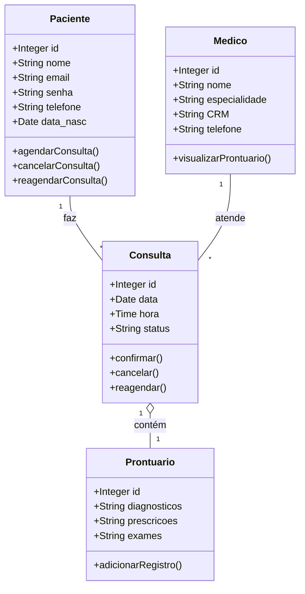
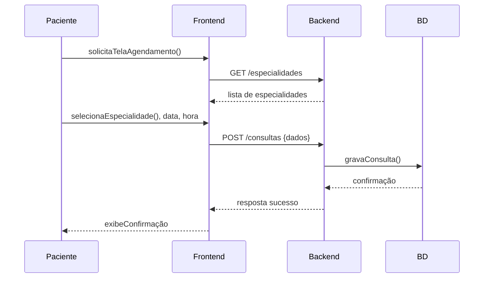
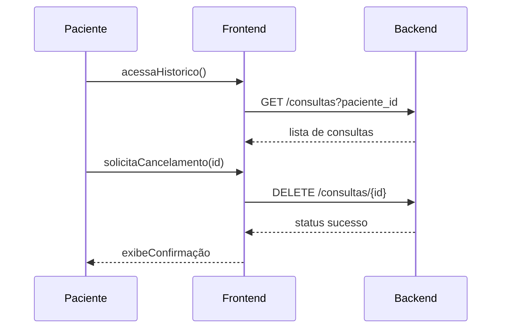
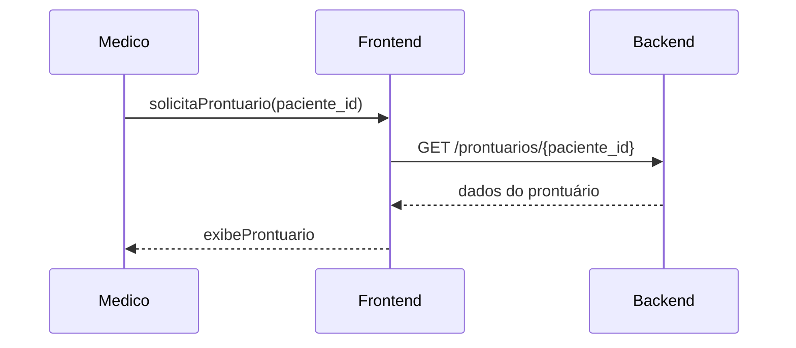

# Sistema de Agendamento de Consultas Médicas

Este repositório reúne a **modelagem e design** do Sistema de Agendamento de Consultas Médicas, desenvolvido na disciplina de Engenharia de Software do curso de Ciência da Computação. O objetivo é prover uma solução completa para pacientes e médicos, contemplando os processos de agendamento, cancelamento, reagendamento e visualização de prontuários eletrônicos.

---

## Introdução

O **Sistema de Agendamento de Consultas Médicas** tem como propósito otimizar a gestão de atendimentos clínicos, promovendo uma interface intuitiva para pacientes e médicos. Ele abrange:

* Marcação de consultas por especialidade, data e horário.
* Cancelamento e reagendamento com notificações automáticas.
* Visualização de prontuários eletrônicos completos.

A modelagem aqui apresentada serve de base para a implementação futura, definindo casos de uso, diagramas de arquitetura e requisitos de teste.

---

## Funcionalidades Principais

1. **Agendamento de Consulta**: seleção de especialidade, médico, data e horário; confirmação com notificação.
2. **Cancelamento e Reagendamento**: flexibilidade para alterar compromissos dentro de regras de prazo.
3. **Visualização de Prontuário Eletrônico**: acesso a histórico de consultas, exames e prescrições pelo médico.
4. **Notificações**: envio de e-mail/SMS para confirmação, lembrete e alterações de agendamento.
5. **Autenticação e Autorização**: perfis diferenciados para pacientes e médicos.

---

## Arquitetura do Sistema

O sistema será dividido em três camadas principais:

* **Frontend**: interface web responsiva (ex. React) para interação com usuários.
* **API Backend**: serviços RESTful (ex. Node.js + Express ou Spring Boot) que expõem endpoints de agendamento, usuário e prontuário.
* **Banco de Dados**: MySQL (ou similar) para armazenar entidades como Paciente, Médico, Consulta e Prontuário.

---

## Modelagem de Dados

| Entidade       | Atributos                                                  | Relacionamentos                                     |
| -------------- | ---------------------------------------------------------- | --------------------------------------------------- |
| **Paciente**   | id, nome, email, senha (hash), telefone, data\_nasc        | 1Paciente − \*Consulta                              |
| **Médico**     | id, nome, especialidade, CRM, telefone                     | 1Médico − \*Consulta                                |
| **Consulta**   | id, paciente\_id (FK), medico\_id (FK), data, hora, status | pertence a Prontuário; referencia Paciente e Médico |
| **Prontuário** | id, consulta\_id (FK), diagnósticos, prescrições, exames   | 1Prontuário − 1Consulta                             |

---

## Casos de Uso

### Caso de Uso 1: Agendar Consulta

**Ator**: Paciente
**Fluxo Principal**:

1. Paciente autentica-se.
2. Seleciona especialidade e data.
3. Sistema apresenta lista de médicos disponíveis.
4. Paciente escolhe médico e horário.
5. Sistema confirma e envia notificação.

**Fluxos Alternativos**:

* Se não houver vagas, solicita nova data/horário.
* Em falha de autenticação, redireciona ao login.

---

### Caso de Uso 2: Cancelar ou Reagendar Consulta

**Ator**: Paciente
**Fluxo Principal**:

1. Paciente acessa histórico de consultas.
2. Seleciona consulta.
3. Opção de cancelar ou reagendar.
4. Para reagendar, escolhe nova data/horário.
5. Sistema atualiza e notifica.

**Exceções**:

* Fora do prazo de cancelamento → notifica indisponibilidade.
* Conflito de horário → sugere alternativas.

---

### Caso de Uso 3: Visualizar Prontuário Eletrônico

**Ator**: Médico
**Fluxo Principal**:

1. Médico autentica-se.
2. Seleciona paciente.
3. Sistema exibe histórico completo: consultas, exames, prescrições.

**Exceções**:

* Paciente sem registros → exibe mensagem informativa.
* Falha de autorização → acesso negado.

---

## Wireframes em Baixa Resolução

1. **Login**

```
+----------------------------+
| [Logo]                     |
| Usuário: [__________]      |
| Senha:   [__________]      |
| [ Login ]                  |
+----------------------------+
```

2. **Agendamento**

```
+-----------------------------------------------+
| Especialidade [_________] [Buscar Médicos]    |
| Data: [__/__/____]   Horário: [__:__]         |
| Médicos Disponíveis:                         |
| - Dr. X (09:00, 10:00) [Agendar]              |
| - Dr. Y (11:00, 14:00) [Agendar]              |
+-----------------------------------------------+
```

3. **Confirmação**

```
+-------------------------------+
| Confirmação de Consulta       |
| Médico: Dr. X                 |
| Data: 01/06/2025  Hora: 10:00 |
| [ Confirmar ]  [ Cancelar ]   |
+-------------------------------+
```

---

## Diagrama de Classes



---

## Diagramas de Sequência

### Agendamento de Consulta



### Cancelamento de Consulta



### Visualização de Prontuário



## Plano de Testes (IEEE)

| ID    | Descrição                              | Pré-condição                    | Passos                                                                      | Resultado Esperado                                    |
|-------|----------------------------------------|---------------------------------|-----------------------------------------------------------------------------|-------------------------------------------------------|
| TC-01 | Agendar consulta válida                | Usuário autenticado             | 1. Selecionar especialidade 2. Escolher data/hora 3. Confirmar             | Consulta registrada e notificação enviada            |
| TC-02 | Agendar fora de horário disponível     | Usuário autenticado             | 1. Selecionar data sem vaga 2. Tentar agendar                               | Mensagem de indisponibilidade e sugestão de alternativas |
| TC-03 | Cancelar dentro do prazo              | Consulta agendada                | 1. Acessar histórico 2. Solicitar cancelamento                              | Consulta marcada como cancelada e notificação enviada |
| TC-04 | Cancelar fora do prazo                | Consulta agendada para o mesmo dia| 1. Solicitar cancelamento                                                  | Mensagem de erro informando impossibilidade           |
| TC-05 | Visualizar prontuário com registros   | Paciente com consultas anteriores| 1. Médico acessa prontuário                                                 | Dados de consultas, exames e prescrições exibidos     |
| TC-06 | Visualizar prontuário sem registros   | Paciente sem histórico           | 1. Médico acessa prontuário                                                 | Mensagem informativa “Nenhum registro encontrado”     |
